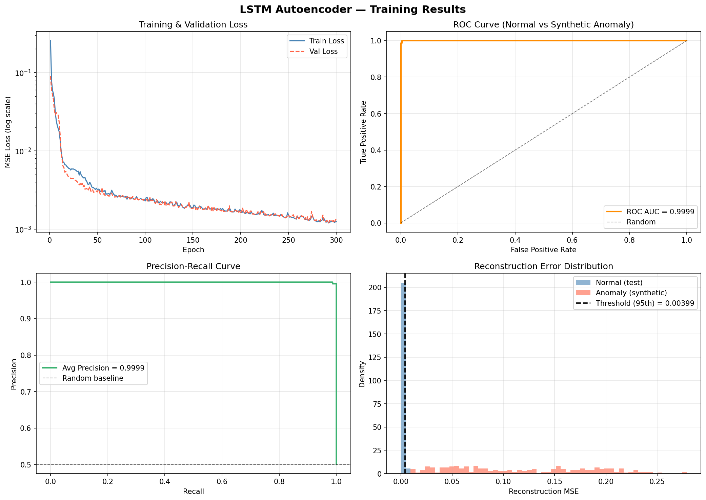

# CareElderly

An iOS app for real-time elderly vital sign monitoring and anomaly detection. Receives heart rate, breathing rate, and body temperature over MQTT, runs a CoreML-integrated LSTM Autoencoder for anomaly scoring, and delivers multi-level guardian alerts (push notification, haptic feedback, full-screen popup).

Built as a graduation project at Xidian University, Class of 2026.

---

## Architecture

```
MQTT Broker  →  MQTTService  →  VitalSignViewModel  ─┬─▶  DashboardView (live chart)
                                                      ├─▶  HealthAnalyticsService (LSTM + HRV)
                                                      └─▶  AppState.triggerGuardianAlert()
                                                                  │
                                                     push notification + haptic + popup
```

**Stack:** SwiftUI · MVVM · Combine · Core Data · Core ML · Network.framework (no third-party dependencies)

---

## Features

### iOS Client
- **Real-time monitoring** — HR, BR, body temperature via MQTT 3.1.1; 30-sample rolling chart (Swift Charts)
- **Dual-role system** — Guardian (full alert UI) and Monitored (read-only dashboard)
- **Guardian alerts** — full-screen popup, Critical Alert push notification, haptic vibration, looping alarm sound; repeats every 30 s until acknowledged
- **History & analytics** — Core Data persistence, date-range filtering, daily trend chart, HRV analysis (RMSSD / SDNN per ESC/NASPE 1996)
- **Threshold configuration** — per-user Warning / Critical thresholds for HR and BR
- **Self-built MQTT client** — MQTT 3.1.1 from scratch on Network.framework; exponential backoff reconnection (3 s base, 60 s max, 20 attempts), QoS 0/1, TLS support

### LSTM Anomaly Detection
- **Dual-threshold design:** rule-based (immediate, 30 s cooldown) + ML-based (10 consecutive anomalous windows)
- **Score badge** on dashboard when anomaly score ≥ 0.33; alert fires when score ≥ 0.70 for 10 consecutive windows
- **5-sample exponential weighted smoothing** before thresholding
- **Fallback** to personalised z-score baseline when buffer < 30 samples or model unavailable

---

## LSTM Autoencoder

### Model Architecture

```
Input  [1, 30, 2]  (30 samples × [HR, BR], normalised to [0,1])
  └─▶  Encoder: 2-layer bidirectional LSTM (hidden=32) → latent vector [64]
  └─▶  Decoder: 2-layer LSTM + Linear → reconstruction [30, 2]

Anomaly score = min(MSE / 0.003995, 1.0)   # 95th-percentile threshold on test set
```

### Training Results

| Metric | Value |
|--------|-------|
| ROC AUC (normal vs synthetic anomaly) | **0.9999** |
| Average Precision | **0.9999** |
| Final train loss (MSE) | 0.001251 |
| Final val loss (MSE) | 0.001333 |
| 95th-percentile threshold | 0.003995 |



### Dataset

Trained on the [BIDMC PPG and Respiration Dataset](https://physionet.org/content/bidmc/1.0.0/) (53 subjects, PhysioNet).  
The dataset is **not included** in this repo — download it from PhysioNet and place it at:

```
LSTM_AutoDetector/LSTM_AutoEncoder/bidmc-ppg-and-respiration-dataset-1.0.0/
```

### Reproduce Training

```bash
cd LSTM_AutoDetector/LSTM_AutoEncoder
pip install torch numpy pandas scikit-learn matplotlib coremltools

# 1. Preprocess dataset → data.npy
python preprocess.py

# 2. Train model (saves vital_autoencoder.pth, plots/, threshold_test.json)
python train.py

# 3. Export to Core ML
python export.py
# → VitalAnomalyDetector.mlpackage  (copy into the Xcode project)
```

---

## iOS Setup

**Requirements:** Xcode 15+, iOS 16+ deployment target

```bash
open Healthcare.mmWave.iOS/Healthcare.mmWave.iOS.xcodeproj
# Run on simulator or device (Cmd+R)
```

Real data requires a running MQTT 3.1.1 broker (e.g. [Mosquitto](https://mosquitto.org), [EMQX](https://www.emqx.io)).  
Configure the broker address in **Settings → Server Configuration**.

### MQTT Message Format

```json
// Vital sign packet
{ "heart_rate_bpm": 72, "respiratory_rate_rpm": 16, "body_temperature_celsius": 36.7, "timestamp_ms": 1711700000000 }

// Alert event packet
{ "type": "alert", "event_type": "fall", "heart_rate_bpm": 60, "respiratory_rate_rpm": 14 }
```

Valid `event_type` values: `cardiac_arrest`, `respiratory_arrest`, `fall`, `heart_rate_high`, `heart_rate_low`, `breathing_abnormal`, `ml_anomaly`

### Demo Accounts

| Username | Password | Role |
|----------|----------|------|
| `guardian1` | `1234` | Guardian |
| `elder1` | `1234` | Monitored |
| `zachary` | `zachary` | Guardian |

---

## Project Structure

```
├── Healthcare.mmWave.iOS/          iOS Xcode project
│   └── Healthcare.mmWave.iOS/
│       ├── Models/                 VitalSignData, AlertEvent, User, CoreDataModels
│       ├── Services/               MQTTService, AuthService, PersistenceController, HealthAnalyticsService
│       ├── ViewModels/             AppState, VitalSignViewModel, AuthViewModel, HistoryViewModel
│       ├── Views/                  Auth, Main, Analytics, Components
│       └── VitalAnomalyDetector.mlpackage
└── LSTM_AutoDetector/
    ├── LSTM_AutoEncoder/
    │   ├── preprocess.py           Dataset preprocessing
    │   ├── train.py                Model definition + training loop
    │   └── export.py               CoreML export via coremltools
    ├── plots/                      Training curves and metric charts
    └── threshold_test.json         95th-percentile MSE threshold
```

---

## Author

Zachary Zikai Nie (聂子开) — Xidian University, School of AI, Class of 2026
